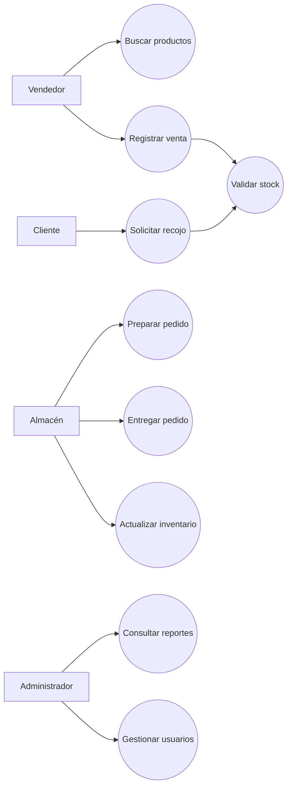

# Diagrama de casos de uso (resumen)

```mermaid
flowchart LR
  V[Vendedor] --> A((Buscar productos))
  V --> B((Registrar venta))
  C[Cliente] --> D((Solicitar recojo))
  E[Almacén] --> F((Preparar pedido))
  E --> G((Entregar pedido))
  E --> H((Actualizar inventario))
  AD[Administrador] --> I((Consultar reportes))
  AD --> J((Gestionar usuarios))
  B --> K((Validar stock))
  D --> K
```
