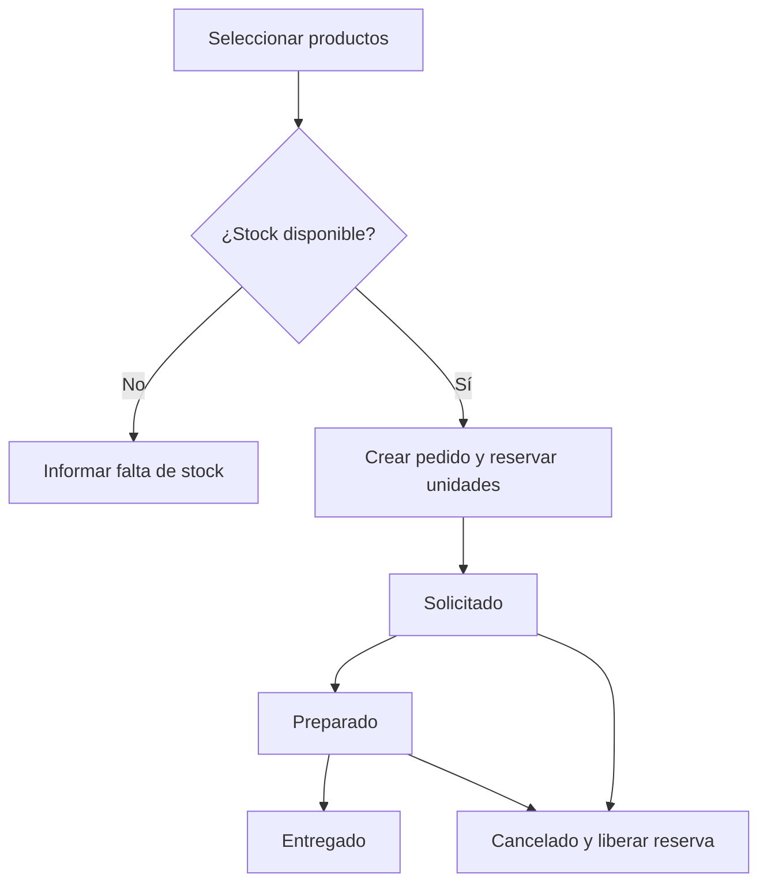

# Flujo de un pedido para recojo

```mermaid
flowchart TD
  A[Seleccionar productos] --> B{¿Stock disponible?}
  B -- No --> X[Informar falta de stock]
  B -- Sí --> C[Crear pedido y reservar unidades]
  C --> D[Solicitado]
  D --> E[Preparado]
  E --> F[Entregado]
  D --> G[Cancelado y liberar reserva]
  E --> G
```

No se permite pasar de `Entregado` a `Solicitado` ni volver a entregar.
