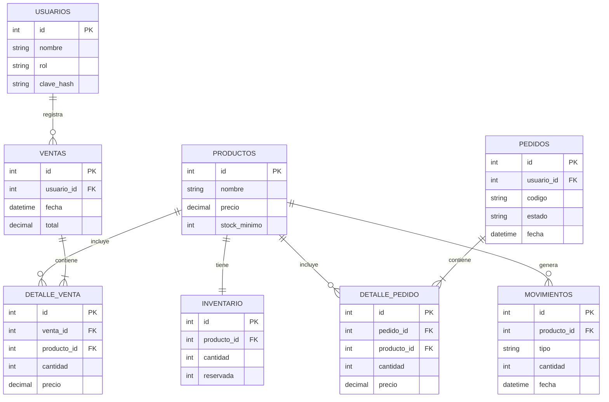

# Modelo relacional propuesto

```mermaid
erDiagram
    USUARIOS { int id PK string nombre string rol string clave_hash }
    PRODUCTOS { int id PK string nombre decimal precio int stock_minimo }
    INVENTARIO { int id PK int producto_id FK int cantidad int reservada }
    VENTAS { int id PK int usuario_id FK datetime fecha decimal total }
    DETALLE_VENTA { int id PK int venta_id FK int producto_id FK int cantidad decimal precio }
    PEDIDOS { int id PK int usuario_id FK string codigo string estado datetime fecha }
    DETALLE_PEDIDO { int id PK int pedido_id FK int producto_id FK int cantidad decimal precio }
    MOVIMIENTOS { int id PK int producto_id FK string tipo int cantidad datetime fecha }
    PRODUCTOS ||--|| INVENTARIO : tiene
    PRODUCTOS ||--o{ DETALLE_VENTA : incluye
    VENTAS ||--|{ DETALLE_VENTA : contiene
    PRODUCTOS ||--o{ DETALLE_PEDIDO : incluye
    PEDIDOS ||--|{ DETALLE_PEDIDO : contiene
    PRODUCTOS ||--o{ MOVIMIENTOS : genera
    USUARIOS ||--o{ VENTAS : registra
```

En una implantación real, adicionar sucursales, lotes, vencimientos, auditoría detallada y validaciones regulatorias.
